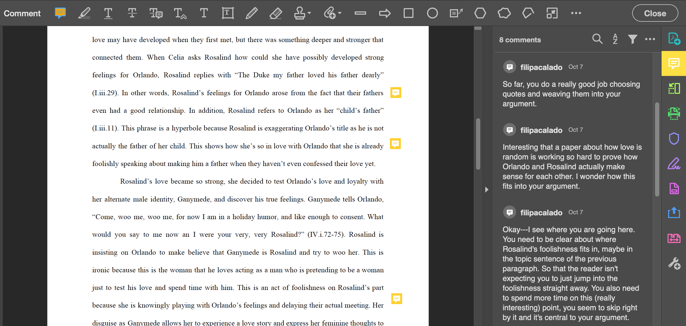

# What is Digital Annotation? 

## In lieu of introductions

Since this workshop is asynchronous, I'll replace the usual icebreaker (where we go around the room and introduce ourselves) with a moment of brainstorming about our intentions for working with Digital Annotation. We will begin, then, by taking five minutes to acquaint ourselves with where we are coming from and what we hope to learn here.

On a sheet of paper or blank text document, explain your interest in Digital Annotation. *What has your experience been in the past? And how do you want or hope to use Digital Annotation in the future?* Though you might not have a full of how Digital Annotation works at this point, try to brainstorm possible goals or strategies for enhancing your teaching. How might Digital Annotation complement your work as an instructor? Take no more than five minutes for your brainstorm.

I'll start: 
> I've been using Digital Annotation in almost all the English classes that I've taught at Hunter College, CUNY, for the past four years. When I taught English 220: Introduction to Writing about Literature, my goal was to use Digital Annotation to model close reading pratices, particularly identifying and analyzing "literary devices" like metaphor and irony. In other classes, I moved from using annotation to model close reading to using it to encourge my students explore and extrapolate on their own interests when they read. I instructed them to highlight what sticks out to them and to explain why they found it striking. The goal was to get my students to connect discrete moments in narrative to ideas and themes from the work at large. For the future, I'm thinking about annotation in a new way, and I'm more interested in highlights than textual responses. How it might annotation engage embodied reactions or feelings that occur during the reading process? Specifically, I've been playing around with highlighter colors to indicate different kinds of nonverbal or preverbal responses to reading. By using annotation in alternative ways, I hope to open up the we read and engage with texts online.

## Defining "Digital Annotation"

Now that we have a stronger sense of what we hope to gain with Digital Annotation, let's jump into the fundamentals. We will begin by unpacking the definition of **Digital Annotation**. 

> Digital Annotation is the use of *digital tools* to *mark up* electronic text. It can be used individually (for self-study and research purposes) or for *social reading*. 

Let's unpack the terms in italics. 

*Digital tools*: an application, either standalone (something you download), as a plugin (browser tool), or embedded into a website. 

*Mark up*: adding comments and/or highlights to text in order to emphasize specific words, phrases, passages. Associated with marginalia. Can be used to indicate moments of interest, questions, confusion, conflict or another reaction. 

*Social Reading*: When you read texts with others, as a group. Can be in a classroom setting, other academic setting, or public setting.

Let's look at some examples of digital annotation tools within social reading environments for teaching. 

First is **Adobe Reader/Acrobat**, a standalone app (meaning that you download the application and it lives on your computer) that allows you to highlight and comment on PDFs.

In the below image, you can see the annotation icon on the right-hand margin, and the comment that corresponds to that icon on the panel. I've used Adobe Acrobat "comment" function to respond to student papers.

Second is **Googledocs**, is a web app (an application in your web browser) that can be used to draft, highlight, and comment text with others.

My students use Googledocs for peer reviewing papers. They highlight a peice of text, and write a comment. You can see their comments on the right-hand side.

## Pegagogical Goals

Before using Hypothes.is, let's come up with some pedagogical goals. First, we will think about some ways you might use Digital Annotation for your own purposes. This exercise works well with a partner or small group, but you can complete it on your own. 
- How are you or people you know already deploying annotation tools or techniques for teaching and learning? How do you want to use annotation for the classroom? Think of some examples that address your own goals and needs with digital annotation. You can say things like, "To have students take notes while I'm lecturing" or "To model close reading' strategies."

See some examples of my own usage in teaching: 

In this image, I use Hypothes.is for modeling "close reading," or close attention to textual detail. Close reading can emphasize elements like figuration or word choice. Here, I'm using annotation to show my students how to dig deeper into the literary devices like metaphor, simile, and imagery. After modeling this activity for my students, they then used annotation to find and analyze other literary devices in the text.

Here, you can see a more free form use of annotation, with students taking initiative to comment on what seems most interesting to them. For this class, I gave explicit directions for students to comment on things that are striking to them.

## Some examples of use cases

Now let's dive into some use cases. The Hypothes.is folks have come up with a useful article outlining [10 Ways to Annotate with Students](https://web.hypothes.is/blog/back-to-school-with-annotation-10-ways-to-annotate-with-students/). Here we have some great starting points for integrading annotation into your classroom. I'm going to highlight a few of the more inspiring strategies, which you can adapt to your own purposes:

### Teacher Annotations:
Pre-populate a text with questions for students to reply to in annotations, or with notes elucidating important points as they read. This is a good opportunity to guide your students toward discussing specific themes and passages in preparation for class discussion. 

### Glossing the Text:
Have students look up difficult words or unknown allusions in a text and share their research as annotations. This creates a little crowd-sourced glossary on the sidebar for useful refererence during reading.

### Posing Questions: 
Have students highlight, tag, and annotate words or passages that are confusing to them in their readings. You can then ask other students try to answer their questions, or devote some class time to reviewing and answering questions. You might even expand this exercise toward constructing research questions or thesis statements. 

### Close Reading: 
Have students identify formal textual elements and broader social and historical contexts at work in specific passages. This is a particularly effective way to teach critical reading strategies and draw students' attention to the ways that language, figuration, and rhetoric can influence our reading of a text. 

### Creating Annotated Bibliographies: 
This method gives students a bit more freedom. Have them research a topic or theme and tag and annotate relevant texts across the Internet. You can follow along with their progress by tracking their username on the hypothes.is website.

### Annotation as Multimedia Writing
For a more playful and experimental assignment, have students annotate with images and video or integrate images and video into other types of annotations. Students will need to think creatively about what images or video relate to specific moments in the text. 

As you can see from the above examples, one of the main benefits of using Digital Annotation for teaching is to draw attention to **concrete elements** of the text. Practice annotation in a way that encourages your students to ground their ideas and arguments in the text. Working from textual evidence in this way allows your students to develop their critical thinking and writing skills.  

## More Pedagogical Resources:

For those of you who want to dig into specifics of using annotation in the classroom, check out these [examples of classroom use](https://web.hypothes.is/examples-of-classroom-use/). This page contains annotation excerpts from undergraduate courses across the US. Take a look at the screen shots to see the ways that students are using annotation in these courses.

If you want to give your students some guidelines for annotating, send them these [Annotation tips for Students](https://web.hypothes.is/annotation-tips-for-students/). This article goes through how to make an annotation, what to pay attention to, and how to make annotations contribute to the reading (rather than summarize the reading). There's also technical information for students who want a little tutorial on how to use the annotation sidebar. 

# Up and Running with H

## Creating an account on Hypothes.is

Please sign up for an account (do not install the plugin yet) on https://web.hypothes.is/start/

Press "Create A Free Account," and enter in your name, email, and password. 

