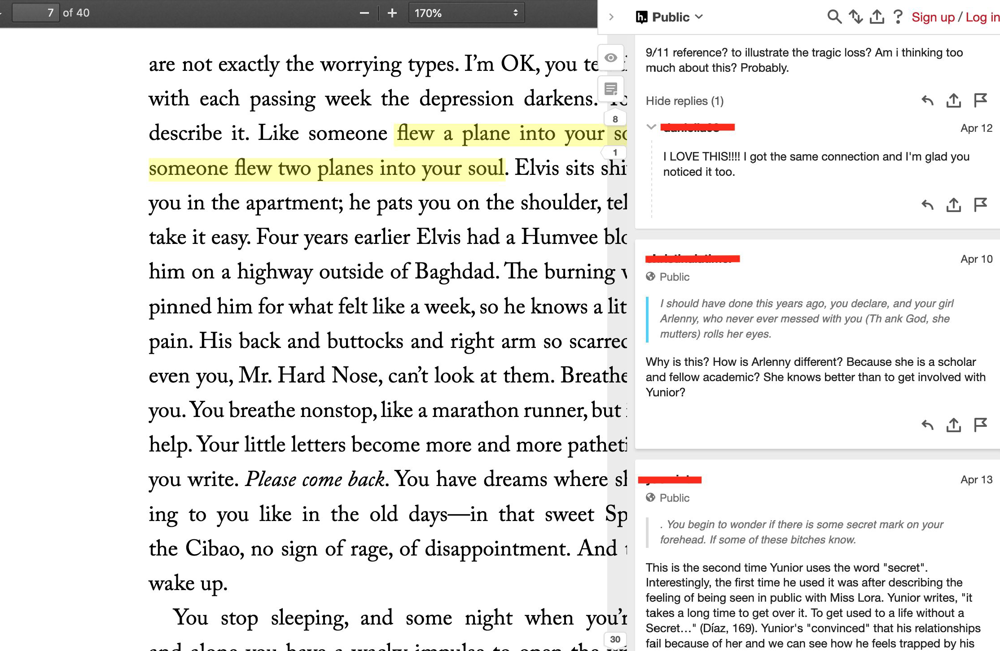
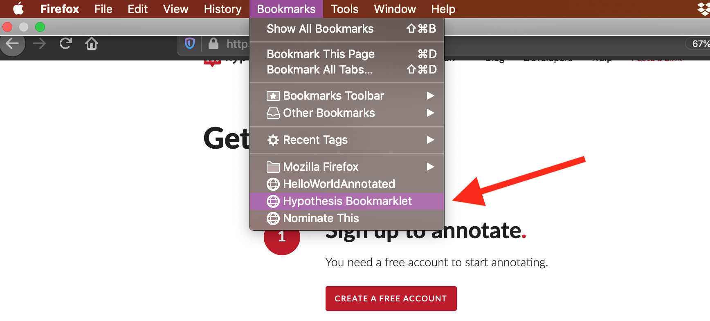
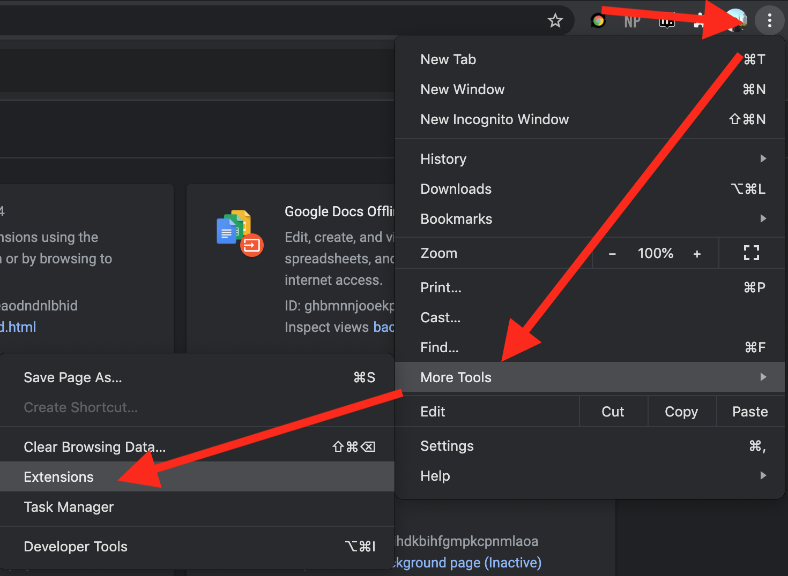

# What is Digital Annotation? 

## In lieu of introductions

Since this workshop is asynchronous, I'll replace the usual icebreaker (where we go around the room and introduce ourselves) with a moment of brainstorming about our intentions for working with Digital Annotation. We will begin, then, by taking five minutes to acquaint ourselves with where we are coming from and what we hope to learn here.

On a sheet of paper or blank text document, explain your interest in Digital Annotation. *What has your experience been in the past? And how do you want or hope to use Digital Annotation in the future?* Though you might not have a solid idea of how Digital Annotation works at this point, try to brainstorm possible goals or strategies for enhancing your teaching. *How might Digital Annotation complement your work as an instructor?* Take no more than five minutes for your brainstorm.

I'll start: 
> I've been using Digital Annotation in almost all the English classes that I've taught at Hunter College, CUNY, for the past four years. When I taught English 220: Introduction to Writing about Literature, my goal was to use Digital Annotation to model close reading pratices, particularly identifying and analyzing "literary devices" like metaphor and irony. In other classes, I moved from using annotation to model close reading to using it to encourge my students explore and extrapolate on their own interests when they read. I instructed them to highlight what sticks out to them and to explain why they found it striking. The goal was to get my students to connect discrete moments in narrative to ideas and themes from the work at large. For the future, I'm thinking about annotation in a new way, and I'm more interested in highlights than textual responses. How it might annotation engage embodied reactions or feelings that occur during the reading process? Specifically, I've been playing around with highlighter colors to indicate different kinds of nonverbal or preverbal responses to reading. By using annotation in alternative ways, I hope to open up the we read and engage with texts online.

## Defining "Digital Annotation"

Now that we have a stronger sense of what we hope to gain with Digital Annotation, let's jump into the fundamentals. We will begin by unpacking the definition of **Digital Annotation**. 

> Digital Annotation is the use of *digital tools* to *mark up* electronic text. It can be used individually (for self-study and research purposes) or for *social reading*. 

Let's unpack the terms in italics. 

*Digital tools*: an application, either standalone (something you download), as a plugin (browser tool), or embedded into a website. 

*Mark up*: adding comments and/or highlights to text in order to emphasize specific words, phrases, passages. Associated with marginalia. Can be used to indicate moments of interest, questions, confusion, conflict or another reaction. 

*Social Reading*: When you read texts with others, as a group. Can be in a classroom setting, other academic setting, or public setting.

Let's look at some examples of digital annotation tools within social reading environments for teaching. 

First is **Adobe Reader/Acrobat**, a standalone app (meaning that you download the application and it lives on your computer) that allows you to highlight and comment on PDFs.

In the below image, you can see the annotation icon on the right-hand margin, and the comment that corresponds to that icon on the panel. I've used Adobe Acrobat "comment" function to respond to student papers.

Second is **Googledocs**, is a web app (an application in your web browser) that can be used to draft, highlight, and comment text with others.

My students use Googledocs for peer reviewing papers. They highlight a peice of text, and write a comment. You can see their comments on the right-hand side.

## Pegagogical Goals

Before using hypothesis, let's come up with some pedagogical goals. First, we will think about some ways you might use Digital Annotation for your own purposes. This exercise works well with a partner or small group, but you can complete it on your own. 
- How are you or people you know already deploying annotation tools or techniques for teaching and learning? How do you want to use annotation for the classroom? Think of some examples that address your own goals and needs with digital annotation. You can say things like, "To have students take notes while I'm lecturing" or "To model close reading' strategies."

See some examples of my own usage in teaching: 

In this image, I use hypothesis for modeling "close reading," or close attention to textual detail. Close reading can emphasize elements like figuration or word choice. Here, I'm using annotation to show my students how to dig deeper into the literary devices like metaphor, simile, and imagery. After modeling this activity for my students, they then used annotation to find and analyze other literary devices in the text.

Here, you can see a more free form use of annotation, with students taking initiative to comment on what seems most interesting to them. For this class, I gave explicit directions for students to comment on things that are striking to them.

## Some examples of use cases

Now let's dive into some use cases. The hypothesis folks have come up with a useful article outlining [10 Ways to Annotate with Students](https://web.hypothesis/blog/back-to-school-with-annotation-10-ways-to-annotate-with-students/). Here we have some great starting points for integrading annotation into your classroom. I'm going to highlight a few of the more inspiring strategies, which you can adapt to your own purposes:

### Teacher Annotations:
Pre-populate a text with questions for students to reply to in annotations, or with notes elucidating important points as they read. This is a good opportunity to guide your students toward discussing specific themes and passages in preparation for class discussion. 

### Glossing the Text:
Have students look up difficult words or unknown allusions in a text and share their research as annotations. This creates a little crowd-sourced glossary on the sidebar for useful refererence during reading.

### Posing Questions: 
Have students highlight, tag, and annotate words or passages that are confusing to them in their readings. You can then ask other students try to answer their questions, or devote some class time to reviewing and answering questions. You might even expand this exercise toward constructing research questions or thesis statements. 

### Close Reading: 
Have students identify formal textual elements and broader social and historical contexts at work in specific passages. This is a particularly effective way to teach critical reading strategies and draw students' attention to the ways that language, figuration, and rhetoric can influence our reading of a text. 

### Creating Annotated Bibliographies: 
This method gives students a bit more freedom. Have them research a topic or theme and tag and annotate relevant texts across the Internet. You can follow along with their progress by tracking their username on the hypothesis website.

### Annotation as Multimedia Writing
For a more playful and experimental assignment, have students annotate with images and video or integrate images and video into other types of annotations. Students will need to think creatively about what images or video relate to specific moments in the text. 

As you can see from the above examples, one of the main benefits of using Digital Annotation for teaching is to draw attention to **concrete elements** of the text. Practice annotation in a way that encourages your students to ground their ideas and arguments in the text. Working from textual evidence in this way allows your students to develop their critical thinking and writing skills.  

## More Pedagogical Resources:

For those of you who want to dig into specifics of using annotation in the classroom, check out these [examples of classroom use](https://web.hypothes.is/examples-of-classroom-use/). This page contains annotation excerpts from undergraduate courses across the US. Take a look at the screen shots to see the ways that students are using annotation in these courses.

If you want to give your students some guidelines for annotating, send them these [Annotation tips for Students](https://web.hypothes.is/annotation-tips-for-students/). This article goes through how to make an annotation, what to pay attention to, and how to make annotations contribute to the reading (rather than summarize the reading). There's also technical information for students who want a little tutorial on how to use the annotation sidebar. 

# Up and Running with H

## Creating an Account on hypothesis

Please sign up for an account (do not install the plugin yet) on https://web.hypothes.is/start/. 

Press "Create A Free Account," and enter in your name, email, and password. 

That's it! You're now a registered member of hypothesis. 

Next, we are going to look at how to use H to annotate. *There are **four** options for using hypothesis*. We will begin with the CUNY Academic Commons, then look at a couple of browser extensions (for Firefox and Chrome), check out a URL workaround, then finish with the embedding option (for the advanced user). 

The reason we are looking at four different ways of using H is to give you the flexibility for using any one of these options. Your technological circumstance will depend on whether you're reading texts on a course website, such as PDFs that you upload, or on the web generally, like news websites or blog posts. You'll also learn some hacky ways of deploying hypothesis, as a backup method if the other methods fail. The main thing is to remain flexible to different technological contexts, so you can provide your students with options and react to obstacles as they arise.

That being said, let's dive into the four options for using H. 

# First Option: H on the CUNY Academic Commons

Using H on the CUNY Academic Commons is the easiest option for your students. They won't have to download or configure anything on their own, because you've already done it for them. They will just need to navigate to the correct CUNY Academic Commons course website and the annotation tool will function automatically. 

This is also arguably the easiest method for the teacher, provided that they already have a course website on the Commons. If you don't have an account on the CUNY Academic Commons, [sign up here](https://commons.gc.cuny.edu/register/). And, if you don't have a course website set up, you can [follow these directions](https://help.commons.gc.cuny.edu/creation-portal-sites/). 

Got a website set up? Good. Now we can activate the hypothesis plugin on your new course website. The CUNY Academic Commons offers a number of "Wordpress Plugins" that are already installed on your site and need to be activated. 

First, navigate to your Dashboard. This should be the main landing page when you click on your site from the dropdown menu on the upper right corner. To get there, hover over your profile picture, then hover over "My Sites," then click on the relevant site. It should bring you to this page:

Once you're here, navigate over to the panel on the left. Look for the tab that says "Plugins." Hover over it or click on it, then click on "Installed Plugins."

Next, you'll see a *loooong* list of plugins that are already installed, but not activated, on your website. Scroll down or (if you're a pro) `Control-F` to find Hypothesis. 

Found it? Good. Now click on the "Activate" button underneath the name.

Great! You're almost there. 

Now we need to configure Hypothesis in your settings. Back in your Dashboard menu, find the "Settings" tab. Hover or click on the tab, and look for the "Hypothesis" option. If the Hypothesis option is *not* there, go back one step and make sure you've activated it on the Plugins directory. 

Once you click on Hypothesis, you'll be taken to the "Settings" page.

Here, you will configure where and how the tool operates on your course website. The specific options are up to you. I generally click the first three boxes, which makes highlights and the sidebar show up on default when the web page loads, and enables PDF annotation, which is essential if you'll be uploading PDFs for your class to read.

If I don't want Hypothesis to load on the front page, or on specific pages, I just check the relevant boxes.

At the bottom, you can manually indicate which pages that Hypothesis should be active. Type the page names into the text box, making sure to copy the name from the way it appears in the URL (you can navigate to the page in your browser, then take a look at the URL bar to see the page name within the larger URL statement). If you're going to manually enter more than one page, use commas and no spaces to separate page names. See below for an example.

Always remember to press "Save Changes" at the bottom of this page after you've finished entering your settings. 

And that's it! You should be able to see Hypothesis automatically load on the pages or PDFs of your course site, depending on how you've configured the settings. If it's not to your liking, you can always come back to change things later. 

# Second Option: H as a Browser Extension

Using Hypothesis as a Browser Extension means that you will be activing the tool when you navigate to a website. It is slightly more work for the user, but it is not technically difficult. In order to use the browser method, you must install the plugin herself on either Chrome or Firefox browsers. If you cannot use one of these web browsers, skip down to the **Via Method** option for using Hypothesis.

First, if you haven't already, please [sign up for a Hypothesis account](https://hypothes.is/signup). 

The next steps for installing and activating the plugin will depend on whether you are using a Firefox or Chrome web browser. The objective is the same, but the specific process differs for each browser. 

If you get stuck or want more information, check out Hypothesis's "[Quick Guide for Teachers](https://web.hypothes.is/quick-start-guide/)."

## Using H with Firefox: The Bookmarklet

Begin on the Hypothesis "Get Started" page. Under the step #2 heading, "Add Hypothesis to your browser," look for the **Hypothesis Bookmarklet** button. 

Right click on this button (on a laptop, you can do this by pressing two fingers on the track pad). From the dropdown menu, select "bookmark this link". 

Alternatively, you can click and drag the button onto your Bookmarks Toolbar. Either way, make sure you note where the bookmark is saved, so you can access it later.

To activate the tool, you'll simply click on the Hypothes.is bookmark from your bookmark menu. This will automatically load Hypothesis on whatever page is currently in your browser. 

The Hypothesis toolbar should appear on the righthand side, as a panel on the edge of your window. You can expand the toolbar by clicking on the little arrow at the top of this panel.

In order to make annotations, you'll have to login to your Hypothesis account.

You can test out this method by navigating to your favorite website and clicking the bookmark. You'll see that some really large websites (like [The New York Times](https://nytimes.com)) take a little while to load the tool, while smaller websites (like [CBS New York](https://newyork.cbslocal.com/category/news/ny-news/)) will load the tool almost immediately. Make sure you test out the bookmarklet on whatever site you're using before sending your students over to annotate on that site. 

## Using H with Chrome: the Plugin

First, go to the Google Chrome web store, and [search Hypothesis](https://chrome.google.com/webstore/search/hypothesis). The digital annotation tool should be the top result. 

When you get to the Hypothesis page on the Chrome web store, click "Add To Chrome" on the right. 

Once you have added Hypothesis as a browser extension, all you need to do is activate the extension. Go to the top right corner of your screen, and click on the button with the three dots, also known as the "More" tab. It should be the furthest icon on your Chrome toolbar.

In the dropdown menu that appears, click on the "More Tools" option. Another dropdown should appear, with a section that says "Extensions." Click on that option. 

Here, you'll make sure that the plugin is turned on by flipping the little switch in the box that says "Hypothesis". 

The Hypothesis browser extension should now be active on your Chrome browser. You should be able to see it in your toolbar, at the top right. The icon looks like the letter "h" within a speech bubble. 

To activate Hypothesis on the current webpage, simply click on this icon. Then, the Hypothesis toolbar should appear on the righthand side, as a panel on the edge of your window. You can expand the toolbar by clicking on the little arrow at the top of this panel.

In order to make annotations, you'll have to login to your Hypothesis account.

# Third Option: The Via Method

This option is slightly more advanced than the browser extension method, but it is more reliable and can be a good back-up method in the event that the browser extension isn't working properly. You can think of it as a "hack" that gets hypothesis to load when all else fails. 

Whenever I teach a class that uses Hypothesis, I always introduce my students to this method, even if I do not explicitly have them use it. The reason is that I want them to be familiar with this back-up option in the case that Hypothesis isn't working. At some point or another, I've had issues with getting the extension to load, as well as minor problems with loading the tool on my CUNY Academic Commons page. The Via Method is pretty reliable and functions as a last minute workaround that "forces" the Hypothesis tool to activate.

The process for using the Via Method is very straightforward. First, navigate to the webpage where you want to use Hypothesis. Then, take a look at the URL bar, it should look something like this:

> `https://www.wsj.com`

At the beginning of the URL, add the following text, making sure that you include the `https://` and the final `/` before the regular URL.

> `https://via.hypothes.is/` 

This snippit is known as the **via link**. The URL bar should then appear like so:

> `https://via.hypothes.is/https://www.wsj.com`

When everything looks ready, you can reload the page (do this by pressing enter). The Hypothesis sidebar should automatically appear, which you can see on the right hand side. 

Neat, right? This little snippit `https://via.hypothes.is/ `, which works like a "prefix," activates hypothesis on whatever website that follows the Via URL. You can copy and paste the snippit wherever you want it, and you don't need to mess with the browser extension or embedding the tool at all. Like I said before, the Via Method works very well as a back-up option. 

# Fourth Option: Embedding H into your Website

# Reading Groups

